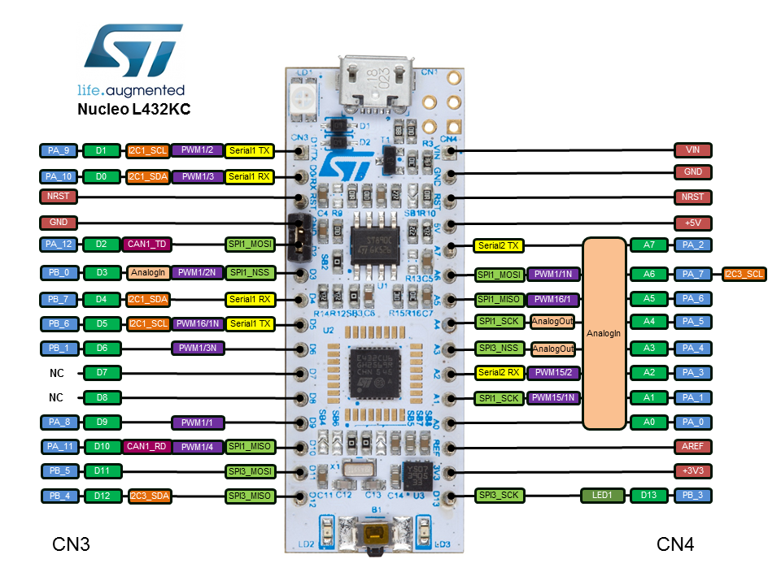

# CanoKey_MDK
## 介绍

开源安全密钥的核心实现，支持：

- 带有 ed25519 和 HMAC-secret 的 U2F / FIDO2
- OpenPGP Card V3.4，[支持算法列表](https://docs.canokeys.org/userguide/openpgp/#supported-algorithm)
- PIV (NIST SP 800-73-4)
- HOTP / TOTP
- NDEF

The USB mode contains 3 different interfaces:

- Interface 0: U2F / FIDO2, which is an HID interface
- Interface 1: PIV/OpenPGP/OATH Card, which is a CCID interface
- Interface 2: WebUSB, which is not a standard interface
- Interface 3: Keyboard

The WebUSB interface is used to configure the key via a web-based interface.

[CanoKey on STM32](https://github.com/canokeys/canokey-stm32)

- [协议](https://docs.canokeys.org/development/protocols/)

[Canokey Core](https://github.com/canokeys/canokey-core)

[CanoKey Hardware Design](https://github.com/canokeys/canokey-hardware)

- `CanoKey NFC-A`: The Canokey with on-board USB Type-A connector and NFC antenna.
- `CanoKey NFC-C`: The Canokey with USB Type-C connector and NFC antenna.
- `CanoKey Nano-A`: The small-sized Canokey which fits inside USB Type-A port.

## 硬件

### NUCLEO-L432KC（开发板）

Nucleo L432KC 板采用基于 ARM Cortex-M4 的 STM32L432KC MCU，具有广泛的连接支持和配置。以下是 Nucleo L432KC 板的一些亮点：

- 采用 UFQFPN32 封装的 STM32 微控制器
- Arduino Uno V3 连接
- 板载 ST-LINK/V2-1 调试器/编程器，带 SWD 连接器
- 柔性板电源：
    - USB VBUS 或外部源（3.3V、5V、7 - 12V）
    - 电源管理接入点
- 三个 LED：USB 通信 (LD1)、电源 LED (LD2)、用户 LED (LD3)
- 一键式：RESET

- **接线**
    - GND <-> GND
    - D2 (PA12)   <-> USB D+（DP）
    - D10 (PA11) <-> USB D-（DM）
    - VCC <-> VCC

**板上的微型 USB 端口连接到 ST-LINK。请勿将其与 MCU 的 USB 信号引脚混淆。**

✨*NFC 和触摸感应功能在 NUCLEO 板上不可用。*
